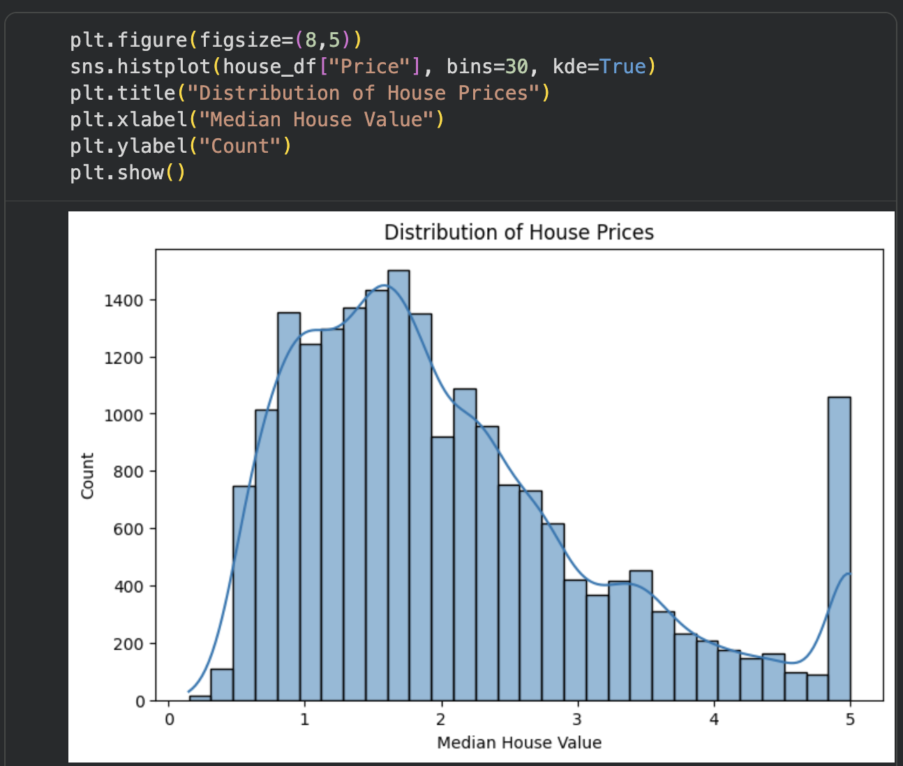
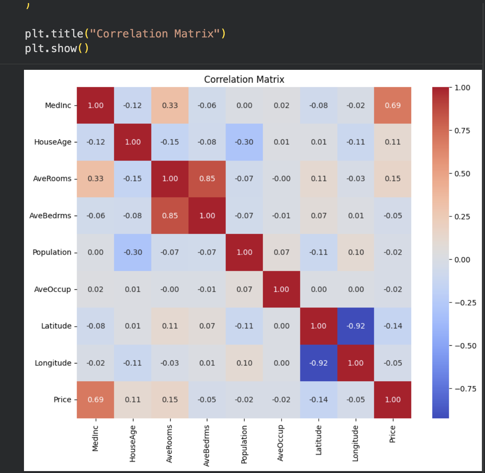
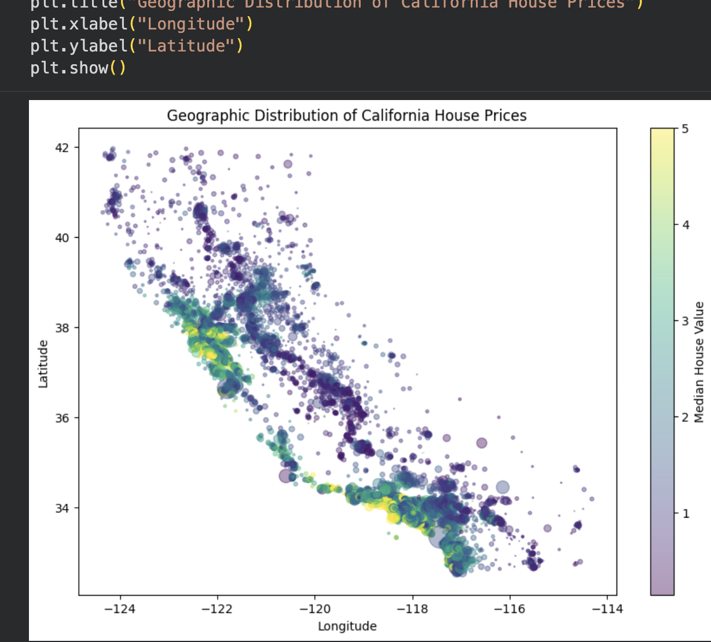
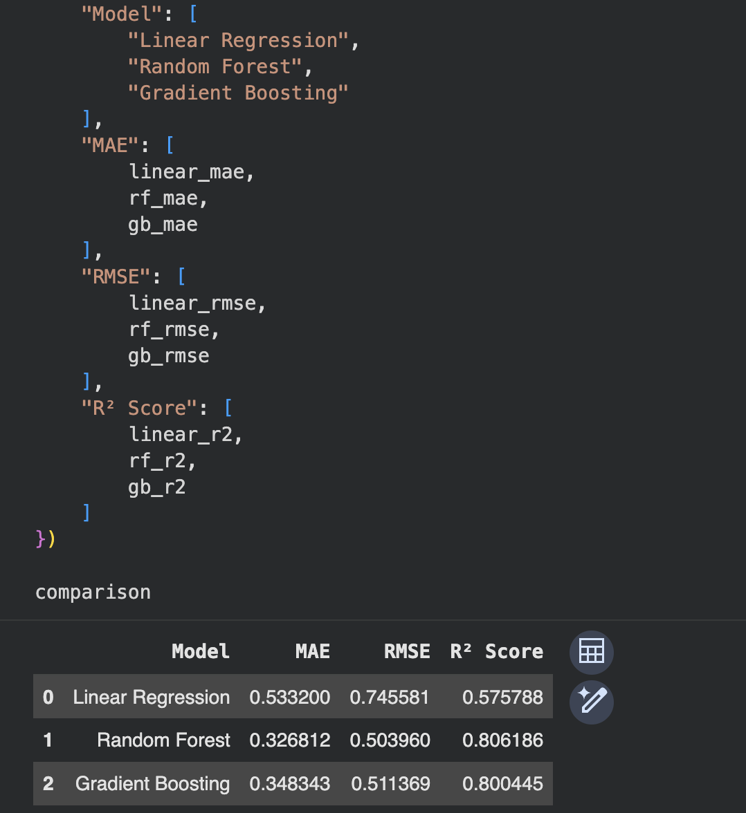
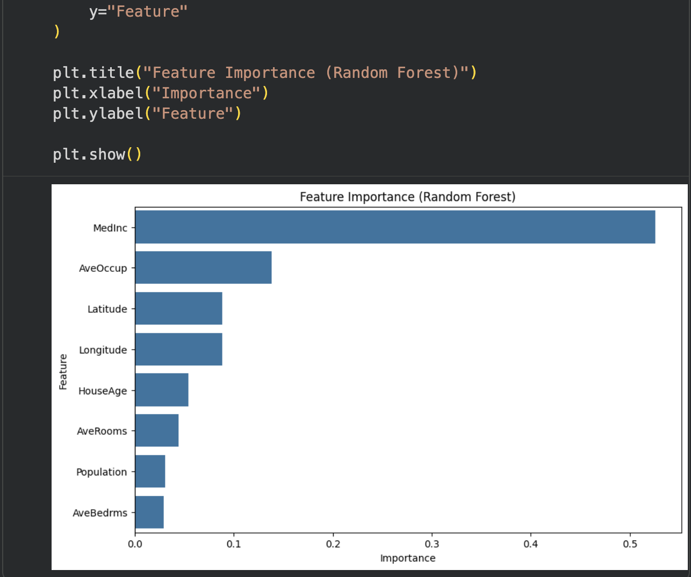
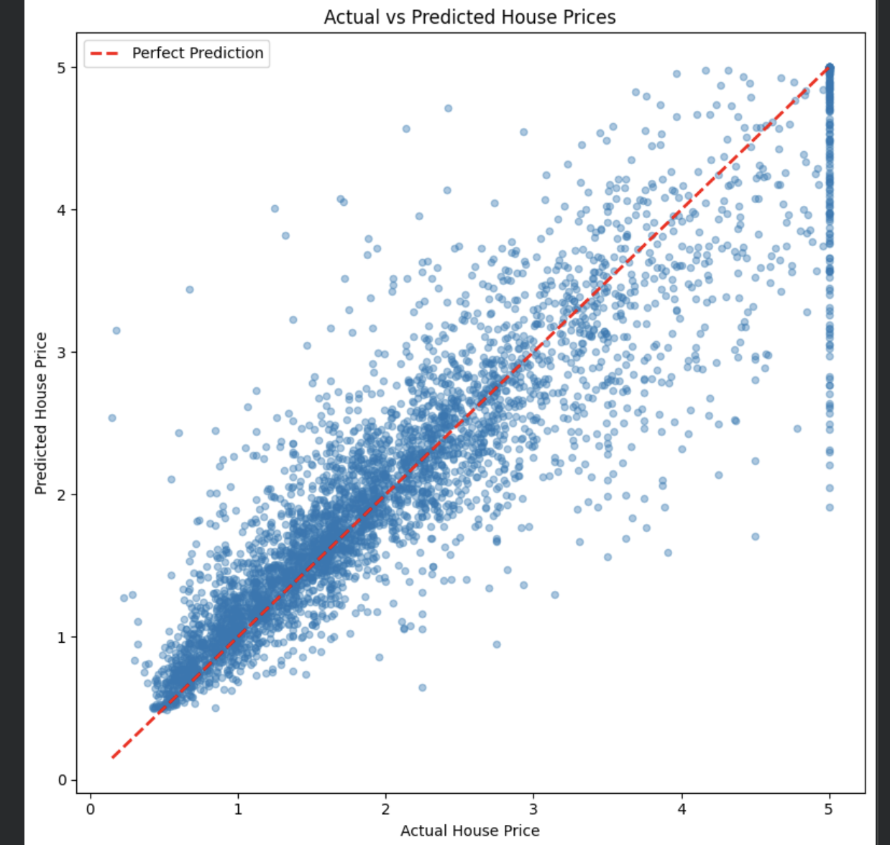
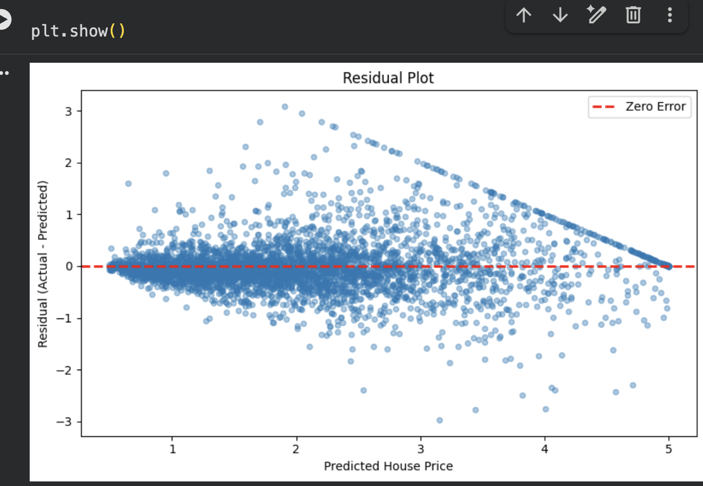

# 🏠 California House Price Prediction Using Machine Learning


---

# 📌 Project Overview

This project develops and evaluates multiple machine learning regression models to predict California housing prices using the California Housing Dataset provided by Scikit-learn.

The project follows a complete machine learning workflow, including:

- Data Exploration
- Exploratory Data Analysis (EDA)
- Data Preprocessing
- Feature Scaling
- Model Training
- Model Evaluation
- Model Comparison
- Feature Importance Analysis
- Prediction Analysis
- Residual Analysis

The objective is to compare multiple regression algorithms and identify the best-performing model for predicting California housing prices.

---

# 🎯 Key Results

- 📊 Dataset: **20,640** California housing records
- 🤖 Models Compared: **3**
- 🏆 Best Model: **Random Forest Regressor**
- 📈 Best R² Score: **0.8062**
- 📉 Lowest RMSE: **0.5040**
- 💰 Lowest MAE: **0.3268**

---

# 📂 Dataset

**Dataset:** California Housing Dataset

**Source:** Scikit-learn

```python
from sklearn.datasets import fetch_california_housing
```

### Dataset Information

- Rows: **20,640**
- Features: **8**
- Target Variable: **Median House Value**

---

# 📊 Features

| Feature | Description |
|----------|-------------|
| MedInc | Median income in the district |
| HouseAge | Median house age |
| AveRooms | Average number of rooms |
| AveBedrms | Average number of bedrooms |
| Population | District population |
| AveOccup | Average household occupancy |
| Latitude | Geographic latitude |
| Longitude | Geographic longitude |

### Target Variable

**Price (Median House Value)**

---

# 🔍 Exploratory Data Analysis

Several visualizations were created to better understand the dataset before training the machine learning models.

## 📈 Price Distribution

The histogram below illustrates how house prices are distributed across California.



---

## 🔥 Correlation Matrix

The heatmap shows the correlation between all numerical variables.

It helps identify relationships between features and the target variable.



---

## 🗺 Geographic Distribution of House Prices

This visualization displays California districts geographically.

- Color represents house prices.
- Point size represents district population.



---

# ⚙ Data Preprocessing

The following preprocessing steps were performed:

- Loaded the California Housing Dataset
- Converted the dataset into a Pandas DataFrame
- Checked for missing values
- Performed Exploratory Data Analysis
- Separated features and target variable
- Split the dataset into training and testing sets (80/20)
- Applied feature scaling for Linear Regression

Random Forest and Gradient Boosting were trained using the original feature values because tree-based algorithms are not affected by feature scaling.

---

# 🤖 Machine Learning Models

Three regression algorithms were implemented and compared.

## 1️⃣ Linear Regression

A simple baseline regression model used for comparison.

---

## 2️⃣ Random Forest Regressor

An ensemble learning algorithm that combines multiple decision trees to improve prediction accuracy and reduce overfitting.

---

## 3️⃣ Gradient Boosting Regressor

A boosting algorithm that builds trees sequentially by correcting the errors made by previous trees.

---

# 📈 Model Performance

| Model | MAE | RMSE | R² Score |
|------|------:|------:|------:|
| Linear Regression | 0.5332 | 0.7456 | 0.5758 |
| **Random Forest Regressor** | **0.3268** | **0.5040** | **0.8062** |
| Gradient Boosting Regressor | 0.3483 | 0.5114 | 0.8004 |

## 📊 Model Comparison



---

# 🌳 Feature Importance

Feature importance was calculated using the Random Forest model.

The analysis shows that:

- **Median Income** is the most influential feature.
- **Latitude** and **Longitude** also contribute significantly.
- Geographic location plays a major role in predicting house prices.



---

# 🎯 Prediction Analysis

## Actual vs Predicted Values

This visualization compares the predicted house prices with the actual values.

The red diagonal line represents perfect predictions.

Most observations are located close to the diagonal, indicating strong predictive performance.



---

## Residual Plot

Residual analysis evaluates the prediction errors made by the model.

Most residuals are randomly distributed around zero, indicating that the Random Forest model generalizes well.

The diagonal boundary visible in the residual plot is caused by the capped target values in the California Housing Dataset rather than poor model performance.



---

# 🏆 Best Performing Model

Among the three regression models, the **Random Forest Regressor** achieved the best overall performance.

### Performance Summary

- **MAE:** 0.3268
- **RMSE:** 0.5040
- **R² Score:** 0.8062

The Random Forest model significantly outperformed Linear Regression by capturing nonlinear relationships within the housing data while maintaining lower prediction errors.

---

# 🛠 Technologies Used

- Python
- Pandas
- NumPy
- Matplotlib
- Seaborn
- Scikit-learn
- Jupyter Notebook

---

# 📁 Project Structure

```
california-house-price-prediction/
│
├── images/
│   ├── price_distribution.png
│   ├── correlation_matrix.png
│   ├── geographic_distribution.png
│   ├── model_comparison.png
│   ├── feature_importance.png
│   ├── actual_vs_predicted.png
│   └── residual_plot.png
│
├── notebooks/
│   └── california_house_price_prediction.ipynb
│
├── README.md
├── requirements.txt
└── .gitignore
```

---

# 🚀 Future Improvements

Potential enhancements include:

- Hyperparameter tuning using GridSearchCV
- Cross-validation
- XGBoost Regressor
- LightGBM Regressor
- SHAP values for model interpretability
- Model deployment using Flask or Streamlit

---

# 📚 How to Run the Project

1. Clone the repository

```bash
git clone https://github.com/yourusername/california-house-price-prediction.git
```

2. Navigate to the project folder

```bash
cd california-house-price-prediction
```

3. Install the required libraries

```bash
pip install -r requirements.txt
```

4. Open the notebook

```bash
jupyter notebook
```

5. Run all cells in:

```
notebooks/california_house_price_prediction.ipynb
```

---

# 👨‍💻 Author

**Mario Jakupas**

Master of Science in Computer Science

Machine Learning • Data Analytics • Python
